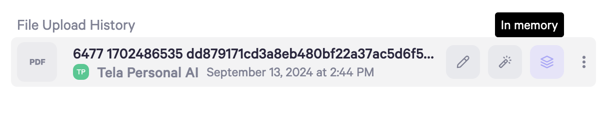

**AI Controls** for your Personal AI is how you can control the behavior of your AI down to every DM and every Channel. This setting can be found at the top of each DM or Channel that you own.

You can change the AI mode (Copilot/Autopilot), threshold for when to not respond (Personal Score Settings), and Voice Response (On/Off) and it will be reflected in real time.

### AI Mode Setting

AI Mode determines whether your AI automatically responds when prompted or creates a draft response for you to review, edit and approve before sending.

Selecting **Copilot** you always stay in the loop by reviewing and editing your AI's responses before they go out.

Selecting **Autopilot**, your AI will respond automatically, unless [Personal Score](/o/nbVBaUyixnBYw8JgeVIt/s/dbMN7r709l6jIY1z4OHN/messaging-your-ai/ai-controls#personal-score-settings) is enabled and the response is below the set threshold.

### Personal Score Settings

The personal score is a measure of how accurate the AI thinks its response is to you. The higher the score, the more confident the AI is that the answer it has provided could be coming from you. When you don’t have personal thoughts on a topic that is new to your AI, then the personal scores for that topic are expected to be lower.

If AI is set to Copilot, you must Edit and Send. Therefore, if your AI is set to Copilot, setting a personal score threshold does not change the behavior since your AI is making suggestions and not sending the message.

If AI is on Autopilot and an AI response has a personal score below the threshold you set, you will receive a copilot message that you can Edit and Send. Suppose the AI response is above the threshold (ex, the threshold is set at 60% personal, and the response is more than 60% personal). In that case, the message will automatically be sent like a standard autopilot message.

The Personal Score is customizable for each DM and channel. Therefore if you want the threshold enabled in multiple places, you can.

### Voice Responses

* This is currently set by the Personal AI Team if you want this to be ON by default for every new DM.

* You can toggle this on and off inside each individual chat and direct message.

### **Conversation Starters**

Conversation starters are clickable prompts designed to help people know what to ask your AI. They appear to your contacts directly above the chat bar in DMs and Channels when your AI is in Autopilot mode.

