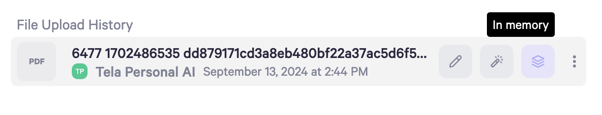

**Channel** **AI Controls** is how you can control the behavior of your AI in each Channel. This setting can be found at the top right of Channels you own.&#x20;

You can change the [AI mode](https://app.gitbook.com/o/nbVBaUyixnBYw8JgeVIt/s/dbMN7r709l6jIY1z4OHN/messaging-your-ai/ai-controls#ai-mode-setting) (Copilot/Autopilot), threshold for when to not respond ([Personal Score Settings](https://app.gitbook.com/o/nbVBaUyixnBYw8JgeVIt/s/dbMN7r709l6jIY1z4OHN/messaging-your-ai/ai-controls#personal-score-settings)), and more. Changes made here will be reflected in real time.

### Default AI

This is where you can choose the main persona that will respond in the channel and update reply settings.

Default AI menu

**AI Reply Settings** - change the mode in which your AI persona replies

* Autopilot - your AI will respond automatically, unless [Personal Score](https://app.gitbook.com/o/nbVBaUyixnBYw8JgeVIt/s/dbMN7r709l6jIY1z4OHN/messaging-your-ai/messaging-in-channels/channel-ai-controls#personal-score-settings) is enabled and the response is below the set threshold.

* Copilot - always stay in the loop by reviewing and editing your AI's responses before they go out

* Off - your AI will not respond to messages within the channel

**Reply on Mention Only** - restricts the AI to responding only when tagged.

**Default Message** - Use a default message when AI response is below the personal score set. Set or edit default message in [Messaging Defaults](https://app.gitbook.com/o/nbVBaUyixnBYw8JgeVIt/s/dbMN7r709l6jIY1z4OHN/customizing-your-ai/messaging-defaults).

Personal Score is below threshold so Default Message was sent&#x20;

**Fallback Suggestion** - Drafts a copilot message when AI response is below threshold. Review, edit as necessary and send. If Default Message and Fallback Suggestion are set to ON, both Default Message and Fallback Suggestion will respond with Fallback Suggestion as a draft that can be reviewed and edited before sending.

Personal Score is below threshold so Default Message and Fallback Suggestion were sent with Fallback Suggestion as a draft.

**Voice Responses** - Generates an audio version of your AIs text response.

**AI Response** - Use the slider to set a minimum personal score for your AIs responses. If the personal score of a response falls below this threshold, a Default Message and/or Fallback Suggestion will be generated if those settings are turned on. If the personal score of a response is above this threshold, your AI will generate a response.

In this example, the AIs response would need to have a [personal score](/o/nbVBaUyixnBYw8JgeVIt/s/dbMN7r709l6jIY1z4OHN/messaging-your-ai/ai-controls#personal-score-settings) of at least 60% in order to send a response.

### AI Mentions

Add and manage up to 10 personas that can be tagged to respond within the channel.

### Channels

Manage channel directive, upload and memory settings for your AI within each channel.

**Channel Directive** - select the [Channel Directive](/o/nbVBaUyixnBYw8JgeVIt/s/dbMN7r709l6jIY1z4OHN/customizing-your-ai/channel-directives) that will be used by the default AI.

**Channel Upload** - Allows channel members to upload messages, files, and more to the default persona

**Multi-Memory** - Allow personas to remember and store to memory conversations with all channel members